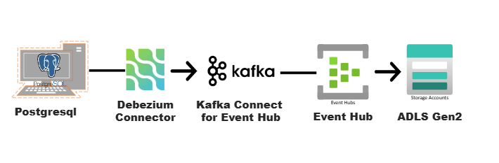
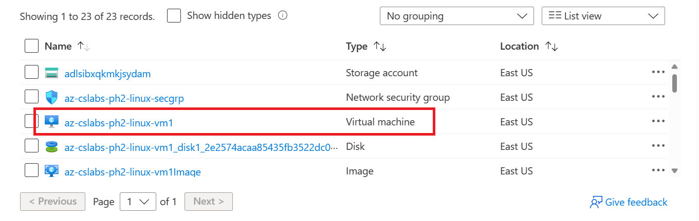
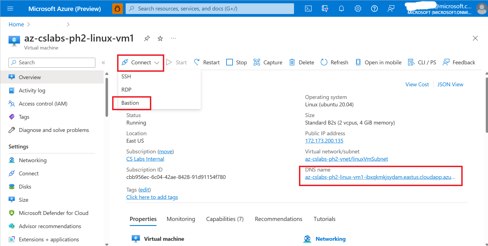

# Data Ingestion and Integration of Streaming Data

In this lab step, we will use the below architectural flow to extract the data from the Postgresql server.



  Let's look into detail about the process followed:  
  Here, we are using **Postgres** as a source for our data - both batch and streaming data.   
To move the streaming data from Postrges to our ADLS account, we use **Debezium Connector** and **Kafka Connect** as our supporting components. 
Postgres will have **Change Data Capture(CDC)** configured to record any new changes in the database. To expose these changes to the world, we use the Debezium Connector.
The Debezium Connector has a right connectivity with the Kafka Connect, through which all the new records get captured into the Event Hub. 
Once the data is captured in the Event Hub, we create a **stream analytics job** in order to transfer the data to our ADLS account.

### Objectives:
* Connecting to on-premises data source
* Extracting data onto staging layer (ADLS Gen2 Storage)
* Constructing raw/bronze layer

### Pre-requisites:
* An *Azure account* with an active subscription
* Ensure that the following resources are in the Resource group.
    -	Linux Virtual Machine **[az-cslabs-ph2-linux-vm1]**,
    -	Windows Virtual Machine **[azcslabsph2win1]**,
    -	Eventhub Namespace **[streamdata-{randomString}-ns]**,
    -	ADLS Gen2 Storage **[adls{randomString}]**,
    -	Databricks Workspace with cluster **[dblab-{randomString}], [dbcluster]**
* Users should have *Storage Blob Data Contributor* role for the storage account.

## Exercise 1: Connecting to on-premises data source.
1. Open the Azure Portal. Go to the resource group created.
    
    
    
3. Open the **Linux Virtual Machine** which goes by *az-cslabs-ph2-linux-vm1*.
    
    
    
5. Make a note of the **DNS Name** which is available on the Overview page, which will be later used in this exercise.
    
    hhh
    
7. Select **Connect** at the top on the Overview page.
    
    ggg
    
9. Choose **Bastion** from the options listed.
    
    hhh 1-aaa_ggg.jpg aaa ggg
    aaGgg
    
11. Click on **Create Azure Bastion using defaults**.
    
    hhh
    
13.   Once the Bastion gets updated, Enter **Username**, **Password** and **Connect**.  
      **Username**: `LinuxAdminUser`  
      **Password**: `de22c4!DE22C4@de22c4`  
    
      jjj
    
8. Once the Bastion Shell is opened, login to the following VM.
    
    ```text
    ssh cslabsuser@{DNS-Name-of-linux-VM}
    ```

    If prompted **“Are you sure you want to continue connecting”**, give **yes**.
    If prompted for **“Password:”** , give  `de22c4!DE22C4@de22c4`
    
    jjj
    
9. Acquire the ownership of the Kafka connect config file using the following command.
    
    ```text
    sudo chown $USER /usr/lib/kafka_2.12-3.3.1/config/connect-distributed.properties
    ```
    If prompted for **password**, give `de22c4!DE22C4@de22c4`
    
    lll
    
10. Go back to the Azure Portal. Open the **Windows Virtual Machine** which goes by the name, *azcslabsph2win1*.
    
    ggg
    
12. Select **Connect**, choose **Bastion** from the options in the Overview page.
    
    jjj
    
14.   Provide the **username** and **password** for Windows VM and **Connect**.  
      **Username**: `WindowsVmAdminUser`  
      **Password**: `de22c4!DE22C4@de22c4`  
    
      lll
    
13. After your windows bastion shell is opened, open **Visual Studio Code**.
    
    hhh
    
15. Download the *extension*, **Remote-SSH**.
    
    kkk
    
17. Click on the *Remote-SSH icon* below and choose **Connect to Host**.
    
    lll
    
19. Add the *linux ssh host* and enter.
    
    ```text
    cslabsuser@{DNS-Name-of-linux-VM}
    ```
    
    lll
    
17. If prompted for *platforms*, choose **Linux**. If prompted for *“Are you sure you want to continue?”*, choose **yes**. 
    Provide the *password*, `de22c4!DE22C4@de22c4`
    
    lll
    
19.	If the connection is successful, the SSH Host name will be displayed at the bottom. Click **Open File**.
    
    lll
    
21.	Give the following path:
    
    ```text
    /usr/lib/kafka_2.12-3.3.1/config/connect-distributed.properties
    ```
    
    jjj
    
20.	In order to edit the properties file, go to the Azure Portal. Go to the *Event Hub Namespace* resource -> Shared Access Policies -> click on
    RootManageSharedAccessKey -> copy the **Connection string-primary key**.
    
    lll
    
22.	Now, go back to the properties file in the **Windows Bastion Shell**, edit line 1 for *eventhub namespace name* and lines 28, 32, 36 for *connection string*. 
    And **Save** the file.
    
    lll
    
24.	Go to the **Linux Bastion Shell**, run the *Kafka Connect*.
    
    ```text
    /usr/lib/kafka_2.12-3.3.1/bin/connect-distributed.sh /usr/lib/kafka_2.12-3.3.1/config/connect-distributed.properties
    ```
    
    lll
    
23.	Open another **Linux Bastion shell**. Run the command for creating *Debezium Postgres SQL connection*.
    
    ```text
    curl -X POST -H "Content-Type: application/json" --data @/usr/lib/kafka_2.12-3.3.1/config/pg-source-connector.json http://localhost:8083/connectors
    ```
    
    lll
    
24.	To check the status of the connection.
    
    ```text
    curl -s http://localhost:8083/connectors/retail-connector/status
    ```
    
    lll
    
25.	Once it is set, you can go to your **first Bastion shell** and see the Kafka connect sending streams to the event hub.
    
    lll
    
27. Similarly, we can see the events being processed to the event hubs within the eventhub namespace. streamdata-{randomString}-ns -> Event Hubs
    
    lll
    
## Exercise 2: Extracting data onto staging layer (ADLS Gen2 Storage)

