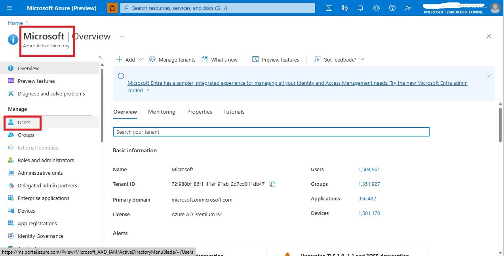
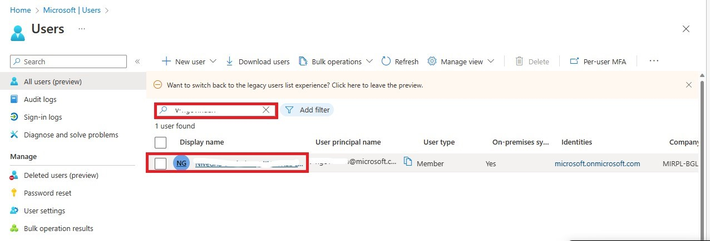
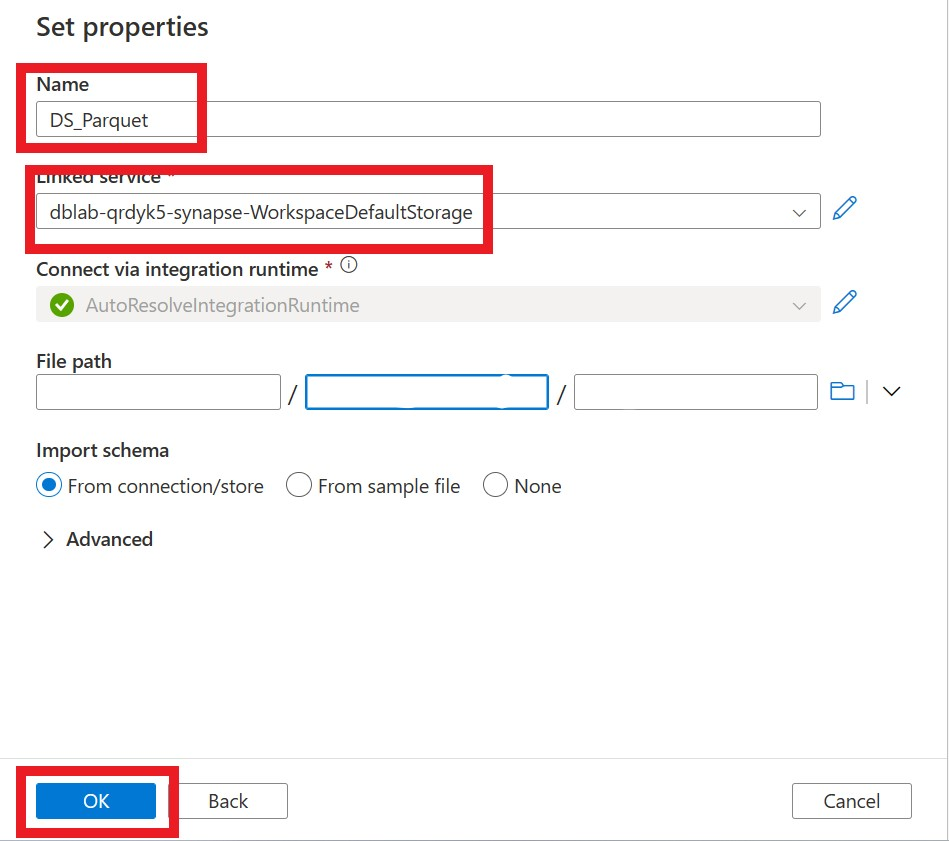

# Data Ingestion of Batch Data

In this lab step, we will use the below architectural flow to extract the data from the Postgresql server.


The datasets which are available in the PostgreSQL server inside the VM is visualized using pgAdmin 4 tool. Using the Self Hosted Integration Runtime and Synapse Pipeline Activity we will ingest the data from the postgres into the adls gen 2 account.

### Objectives:
* Windows Virtual Machine Setup
* Developing Synapse Pipeline to extract batch data

### Pre-requisites:
* An *Azure account* with an active subscription
* Ensure that the following resources are in the Resource group.
    -	Windows Virtual Machine **[azcslabsph2win1]**,
    -	ADLS Gen2 Storage **[adls{randomString}]**,
    -	Azure Synapse Analytics **[dblab-{randomString}-synapse]**
* Users should have *Storage Blob Data Contributor* role for the storage account.

## Exercise 1: Windows Virtual Machine Setup
Let’s begin with setting up the Windows Virtual Machine for the Data Ingestion Process.

We will download the following pre-requisites in the Windows Virtual Machine in order to process the batch data from PostgreSql.
* **pgAdmin 4** – It is the open-source management tool for managing PostgreSQL databases.
* **Open JDK** – Since the files were parsed and written in parquet, it is required to install the Java Runtime Environment on the Self-hosted Integration Runtime machine.
* **Self-Hosted Integration Runtime** – Provides data-integration capabilities across different network environments. Here, it connects our on-premises sql database with synapse.

#### 1. A. Setting up pgAdmin 4
1. Open the **Azure Portal**. Go to the resource group created. 
2. Open the **Windows Virtual Machine** which goes by **azcslabsph2win1**.

    
    
4. Select **Connect** at the top on the Overview page.

    
    
6. Choose **Bastion** from the options listed.
7.   Enter **Username** and **Password** and **Connect**.  
     **Username:** `windowsVmAdminUser`  
     **Password:** `de22c4!DE22C4@de22c4`
     
     
     
6. Once the bastion is opened. Go to **Microsoft Edge** to download **Self-Hosted Integration Runtime, pgAdmin and OpenJDK**.
7. Link to download pgAdmin 4.
    `https://www.pgadmin.org/download/`
    
    
    
    
    
8. After installation, go to pgAdmin. Set the **Master Password** for pgAdmin as `admin`.

    
    
10. Register the retail server in the pgAdmin and view the database. Right click on Servers in the Browser pane on your left. Click **Register** -> **Server**.

    
    
12. In the 'General' tab of properties, give **Name** of the server as `retail`.

    
    
14. In the 'Connection' tab, give **Hostname/address** as `10.1.0.4` , **Password** as `postgrespw` and toggle on **Save Password**. Click **Save** below. 

     
     
16. Once the connection is successful, you can view the database, **retail_org**, and  tables, **customers.csv, products.csv, sales_orders.csv**.

     
     

#### 1. B. Setting up OpenJDK
13. Link to download OpenJDK.
    `https://openjdk.org/`
    
    Inside this link, click on `jdk.java.net/19`, download windows/64 zip folder.
    
    
    
    
14. Go to **File Explorer**. Go to **C:\Program Files**. Inside the **Program Files** folder, create a **new folder** named `java`.
15. Open the downloaded jdk zip folder. You will find a **jdk-19.0.1** folder inside. Copy the jdk-19.0.1 folder and paste it inside the java folder which you have    created in the previous step. 

    
    
17. Once copy pasted, make sure that you find the **jvm.dll** file is present in the following path. **C:\Program Files\java\jdk-19.0.1\bin\server\jvm.dll**

    
    
19. Now, we will add these paths to the environment variables. For that, copy the link until bin folder. 

    
    
21. Search for **Edit the system environment variables** in your vm. 

    
    
23. Click on **Environment variables** in the *System Properties* page.

    
    
25. Under **System variables**, click on **Path** variable and **Edit**.

    
    
27. In **Edit Environment** Variable, click **New**, paste the path which you have copied at step 17, `C:\Program Files\java\jdk-19.0.1\bin`. Click **Ok**. 

    
    
29. Under **System variables**, click on **New**.
30. In **Variable Name**, give `JAVA_HOME`. In **Variable value**, give the path. `C:\Program Files\java\jdk-19.0.1\` Click **Ok** in both the ‘New System Variable’ pop-up and ‘Environment Variable’ and ‘System Properties’ page.

    
    

#### 1. C. Setting up Self-Hosted Integrated Runtime
24. Link to download Self-Hosted Integration Runtime.
    `https://www.microsoft.com/en-us/download/details.aspx?id=39717`
    
    
    
    
25. Go to **Azure Portal** and go to the **Azure Synapse Analytics** workspace which goes by the name, **dblab-{randomid}-synapse**.

    
    
27. Click on **Open Synapse Studio** tile.

    
    
29. If you face the below error, click **Ok**.

    
    
31. Go back to the **Azure Portal**. Navigate to **Azure Active Directory** service. Click on **Users** under *Manage*.
     
     
     
33. Search for your **Microsoft id**. And click on it to view the details.

    
    
35. You can find the **Object id** under *basic info*. Copy the id.

    
    
37. Go to *Synapse Studio*. In the **Manage** tab, go to **Access Controls** under *Security*. Click **Add**.

    
    
39. Under *Role*, select **Synapse Administrator**. Under **Object ID**, *paste the ID* which you have copied at step 30 and **Apply**. The user will be successfully added to the Synapse Access controls.

    
    
41. Go to **Integration Runtimes** under *Integrations* in the **Manage** tab. Click on **New**

    
    
43. Select **Azure, Self-Hosted**

    
   
45. Select **Self-Hosted** in the Network Environment Page.

    
   
47. Leave the default name as **IntegrationRuntime1** and **Create**

    
   
49. Copy anyone of the **Authentication Keys**

    
    
51. Go to the **Windows Virtual Machine**, paste the authentication key in the Self-Hosted Integration Runtime. Click **Register**.
52. Once it is registered, **Launch the configuration manager**. And **Finish**

    
    
54.   Once the connection is successful, go to Diagnostics tab and test for the postgres connection. Give the following details.  
      **Data Server:** `Postgresql`  
      **Server Name:** `10.1.0.4`  
      **Database Name:** `retail_org`  
      **Authentication Mode:** `Basic`  
      **User Name:** `postgres`  
      **Password:** `postgrespw`  
      
41. The connection should be successful.
 
    
    
> Once the all the three setup is done. **Restart** the Virtual Machine and keep the **Self Hosted Integration Runtime** opened.

## Exercise 2: Developing Synapse Pipeline to extract batch data
Let’s proceed with creating the Azure Synapse Analytics pipeline to ingest data into adls gen 2. 

Here we will use Lookup activity which can retrieve the datasets from Postgres. It reads and returns the content of the tables by executing a query. The output can be a singleton value or an array of attributes, which can be consumed in a subsequent copy, transformation, or control flow activities like ForEach activity. The ForEach activity with Copy data activity will save the tables in parquet file formats within the adls gen2.

42. Go to the **Azure Synapse Studio**, **Integrate** tab. Create **New pipeline**.

    
    
44. In the **Activities** list, drag **Lookup activity** under *General* to the pipeline canvas. In the *Properties* pane, give **Name** as `getpostgrestables`. Also, expand the below Configurations pane of lookup activity, and give **name** as `getpostgrestables` in *General* tab.

    
    
46. In *Settings* tab of lookup activity, add a **new source dataset**.

    
    
48. Select **PostgreSql** data store and **continue**

    
    
51. Set **Name** as `DS_Source`, to add a new *Linked Service* select **New**.

    
    
53.   Fill the following and **Create**.  
      **Name** as `LSpostgres`  
      **Intgration Runtime** as `IntegrationRuntime1`  
      **Server Name** as `10.1.0.4`  
      **Database name** as `retail_org`  
      **Username** as `postgres`  
      **Password** as `postgrespw`  
      
      
      
      
49. After creating the new linked service, click **Ok**.

     
     
51. Choose **Query** option in *Use query*. And give the following query in Query Editor.
    
    ```sql
    select table_name from INFORMATION_SCHEMA.Tables
    where table_schema = ‘public’
    ```
    
    
    > Make sure First Row Only option is unchecked.

50. Drag and drop **ForEach activity** under `Iteration & Conditionals` from the **Activities pane** to the pipeline canvas. **Connect** the Lookup activity and ForEach activity. Select the *ForEach activity*, expand the below configurations pane, set **Name** as `loopingretailtables` in the *General* tab.

    
    
52. In the *Settings* tab, **enable** the Sequential option. Select the **Items** field and then select the **Add dynamic content link** to open the dynamic content editor pane.

    
    
54. Select the activity to be executed in the dynamic content editor. In this lab, we select the output value of the previous lookup activity. Give the following,  

    ```text
    @activity(‘getpostgrestables’).output.value
    ```
    
    Click **Ok**.
    
    
    
54. In the *Activities* tab below, click on the **edit** icon for **ForEach** Case.

    
    
56. Drag and drop the **Copy data** activity under *Move & transform* from the Activities pane to the pipeline canvas. In the *General* tab of configurations pane below, set **Name** as `Copy data`.

    
    
58. In the *Source* tab, create a **new Source dataset**.

    
    
60. Select **PostgreSql** data store and **continue**.

    
    
62. In the Set properties window, set **Name** as `DS_sink`, select **Linked service** as **LSpostgres** and click on **Ok**.

    
    
    
64. **Open** the source dataset.

    
    
66. Create new parameters in the `Parameters` tab. Give the parameter name as `table_name`. 

    
    
68. In the `Connection` tab of the DS_sink configurations pane below, give the **table name** as `public`, **enable** the Edit option, and click on **Add dynamic content link** to open the dynamic content editor pane.

    
    
70.	Give the expression, 

    ```text
    @dataset().table_name
    ```
    
    Click **Ok**.
    
    
    
66.	Go back to the **Copy data activity** and add value to the table_name using the dynamic content editor.

    
    
68.	Give the expression that returns a JSON Array to be iterated over the table_name.
    ```text
    @item().table_name
    ```
    
    Click **Ok**.
    
    
    
66.	In the *Sink* tab, create a **new sink** dataset.

    
    
68.	Select the **Azure Data Lake Storage Gen2** data store and **continue**.

    
    
70.	Select the file format as **Parquet**, in which the file will be saved in the adls account and **continue**.

    
    
72.	Give **Name** as `DS_Parquet`, choose the **Linked Service** as **dblab-{randomString}-synapse-WorkspaceDefaultStorage** and click **Ok**.

    
    
74.	In the `Parameters` tab, add new parameter as **table_name**.

    
    
76.	Open the DS_Parquet sink. In the 'Connection' tab, give the File path as **data** / **@dataset().table_name** / [Click on Add Dynamic Content Editor to add file name].

    
    
78.	Give the below expression in the editor, 

    ```text
    @concat(dataset().table_name,'.parquet')
    ```
    
    Click **Ok**.
    
    
    
73.	Go back to the *Sink* tab of Copy data activity. Give the value for the table_name as `@item().table_name`.

    
    
75.	Validate All and Publish All.

    
    
77.	Once the pipeline is published, select **Add Trigger**. Choose **Trigger Now**. Click **Ok** in the Pipeline Run window. 

    
    
79.	Once the Pipeline Run is successful, we can view the parquet files of all the three datasets, customers, products and sales_orders in the adls storage account.
81.	In the **Azure Portal**, go to the **adls{uniqueString}** account -> **data** container.

    
    
    
83.	Open all the three directories customers, products and sales_orders and check the parquet files.

    
    
    
