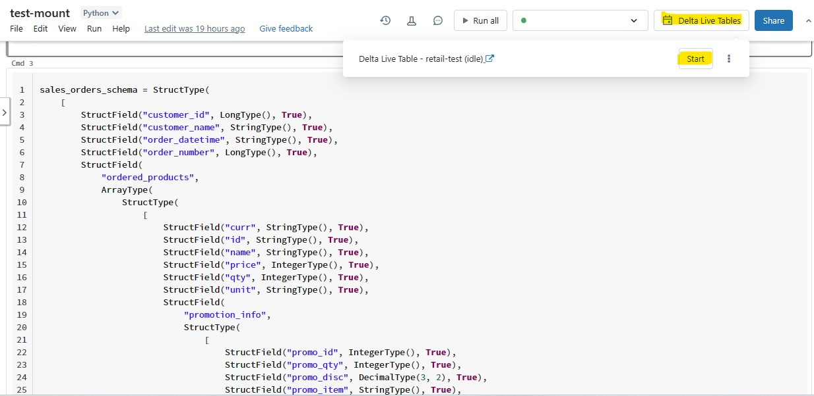

1. Go to the Notebook *retailorg* and paste the following commands.

```python
    sales_orders_schema = StructType(
    [
        StructField("customer_id", LongType(), True),
        StructField("customer_name", StringType(), True),
        StructField("order_datetime", StringType(), True),
        StructField("order_number", LongType(), True),
        StructField(
            "ordered_products",
            ArrayType(
                StructType(
                    [
                        StructField("curr", StringType(), True),
                        StructField("id", StringType(), True),
                        StructField("name", StringType(), True),
                        StructField("price", IntegerType(), True),
                        StructField("qty", IntegerType(), True),
                        StructField("unit", StringType(), True),
                        StructField(
                            "promotion_info",
                            StructType(
                                [
                                    StructField("promo_id", IntegerType(), True),
                                    StructField("promo_qty", IntegerType(), True),
                                    StructField("promo_disc", DecimalType(3, 2), True),
                                    StructField("promo_item", StringType(), True),
                                ]
                            ),
                            True,
                        ),
                    ]
                ),
                True,
            ),
            True,
        ),
        StructField("number_of_line_items", LongType(), True),
        StructField(
            "clicked_items", ArrayType(ArrayType(StringType(), True), True), True
        ),
        StructField(
            "promo_info",
            ArrayType(
                StructType(
                    [
                        StructField("promo_id", IntegerType(), True),
                        StructField("promo_qty", IntegerType(), True),
                        StructField("promo_disc", DecimalType(3, 2), True),
                        StructField("promo_item", StringType(), True),
                    ]
                ),
                True,
            ),
            True,
        ),
    ]
) 
@dlt.table(
    comment="Load data to sales_orders cleansed table",
    table_properties={"pipelines.reset.allowed": "true"},
    spark_conf={"pipelines.trigger.interval": "60 seconds"},
    temporary=False,
)
def sales_orders_cleansed():
    return (
        dlt.readStream("sales_orders_stream_raw")        
        .select(get_json_object(to_json(col("payload")), "$.after").alias("row"))
        .withColumn("row", regexp_replace("row", '"\\[', "["))
        .withColumn("row", regexp_replace("row", '\\]"', "]"))
        .withColumn("row", regexp_replace("row", "\\\\", ""))
        .select(from_json(col("row"), sales_orders_schema).alias("row"))
        .select("row.*")
        .withColumn("ordered_products", explode("ordered_products"))
        .withColumn("order_datetime", from_unixtime("order_datetime"))
        .withColumn("product_id", col("ordered_products").id)
        .withColumn("unit_price", col("ordered_products").price)
        .withColumn("quantity", col("ordered_products").qty)
    )
```

```python
schema = ArrayType(
    StructType(
        [
            StructField("qty", IntegerType(), True),
            StructField("unit", StringType(), True),
            StructField("curr", StringType(), True),
            StructField("id", StringType(), True),
            StructField("name", StringType(), True),
            StructField("price", IntegerType(), True),
            StructField(
                "promotion_info",
                StructType(
                    [
                        StructField("promo_id", IntegerType(), True),
                        StructField("promo_qty", IntegerType(), True),
                        StructField("promo_disc", DecimalType(3, 2), True),
                        StructField("promo_item", StringType(), True),
                    ]
                ),
                True,
            ),
        ]
    )
)

schema2 = ArrayType(
    StructType(
        [
            StructField("promo_id", IntegerType(), True),
            StructField("promo_qty", IntegerType(), True),
            StructField("promo_disc", DecimalType(3, 2), True),
            StructField("promo_item", StringType(), True),
        ]
    ),
    True,
)
schema3 = ArrayType(ArrayType(StringType(), True), True)

@dlt.table(
    comment="Load data to customers cleansed table",
    table_properties={"pipelines.reset.allowed": "true"},
    spark_conf={"pipelines.trigger.interval": "60 seconds"},
    temporary=False,
)

def sales_orders_batch_cleansed():
    return (
        dlt.read("sales_orders_batch_raw")
        .select("*")
        .withColumn("clicked_items", from_json(col("clicked_items"), schema3))
        .withColumn("promo_info", from_json(col("promo_info"), schema2))
        .withColumn("ordered_products", from_json(col("ordered_products"), schema))
        .withColumn("ordered_products", explode("ordered_products"))
        .withColumn("order_datetime", from_unixtime("order_datetime"))
        .withColumn("product_id", col("ordered_products").id)
        .withColumn("unit_price", col("ordered_products").price)
        .withColumn("quantity", col("ordered_products").qty)
    )
    
def customers_cleansed():
    return (
        dlt.read("customers_raw")
    )
```

```python
@dlt.table(
    comment="Load data to a products cleansed table",
    table_properties={"pipelines.reset.allowed": "true"},
    spark_conf={"pipelines.trigger.interval": "60 seconds"},
    temporary=False,
)
```

>If you get an error message saying the data is already mounted, unmount the data using the command **dbutils.fs.unmount("/mnt/data")**.

2. Click on **Delta Live Tables** and **Start**.

   
   
3. Create a new **Python Notebook** in **dbcluster** by clicking on +. Name it ``testwithcdc``.
3. Paste the following command.
```python
import dlt
from pyspark.sql.functions import col, expr

@dlt.view(spark_conf={"pipelines.incompatibleViewCheck.enabled": "false"})
def users():
  return spark.readStream.format("delta").option("ignoreChanges", "true").table("retail_org.sales_orders_batch_cleansed")

dlt.create_streaming_live_table("sales_orders_cleansed")

dlt.apply_changes(
  target = "sales_orders_cleansed",
  source = "users",
  keys = ["order_number"],
  sequence_by = col("order_datetime"),
  stored_as_scd_type = 1
)
```
```sql
%sql
select * from retail_org.sales_orders_cleansed
```
2. Click on **Delta Live Tables** and **Start**.
    
   
4. Go to you **Storage Account** **adls-{random-string} --> data** and make sure the following folders are present.
    * customers_cleansed
    * products_cleansed
    * sales_orders_cleansed

4. Go to your **Databricks Workspace databricks-{random-string} --> Data tab --> hive_metastore catalog --> retail_org** and make sure the **cleansed tables** are present.

