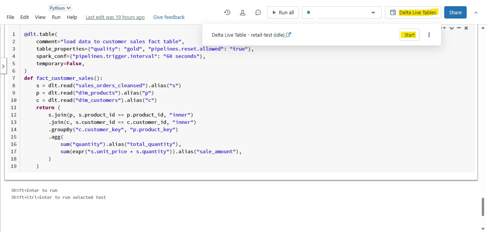
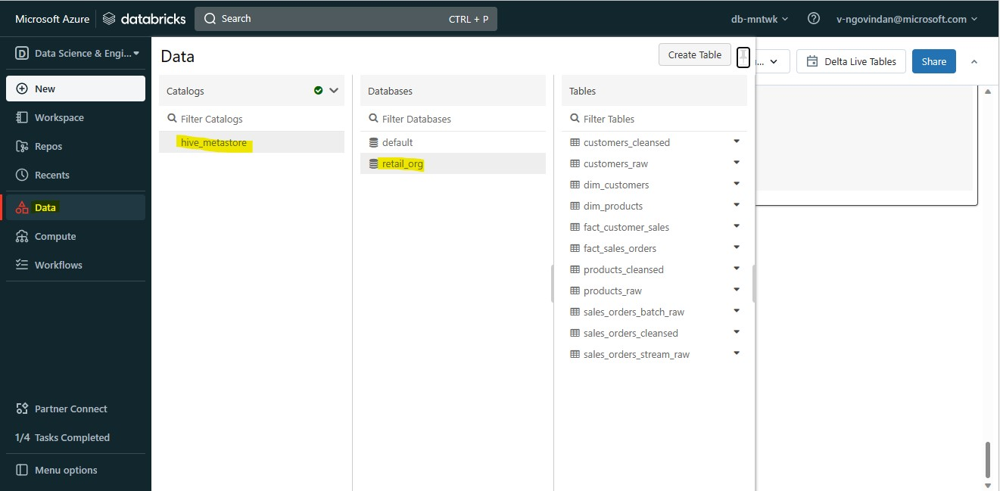
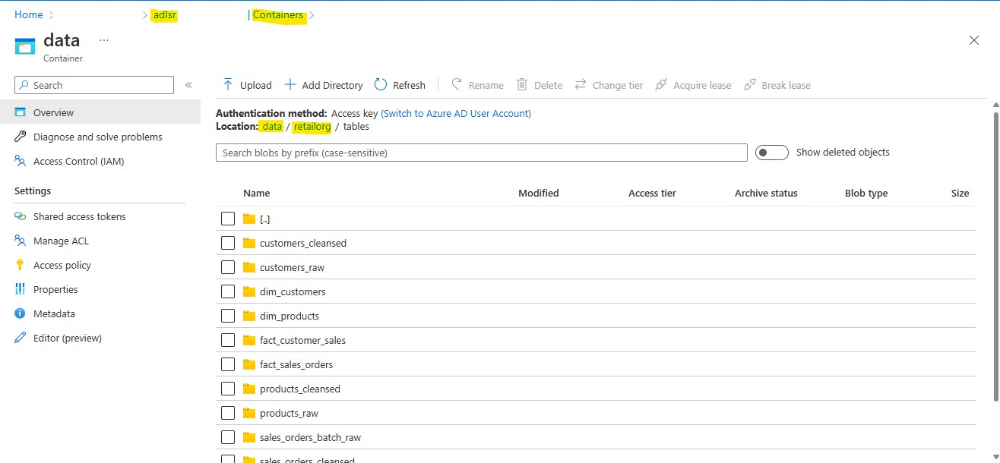

1. Go to the Notebook *retailorg* and paste the following commands.

```python
    @dlt.table(
    schema="""
         product_key BIGINT GENERATED ALWAYS AS identity,
         product_id STRING,
         product_category STRING,
         product_name STRING,
         sales_price STRING,
         ean13 DOUBLE,
         ean5 STRING,
         product_unit STRING    
    """,
    comment="Load data to products dimension table",
    table_properties={"quality": "gold", "pipelines.reset.allowed": "true"},
    spark_conf={"pipelines.trigger.interval": "60 seconds"},
    temporary=False,
)
def dim_products():
    return dlt.read("products_cleansed")
```

```python
@dlt.table(
    schema="""
          customer_key BIGINT GENERATED ALWAYS AS IDENTITY,
          customer_id integer,
          tax_id STRING,
          tax_code STRING,
          customer_name STRING,
          state STRING,
          city STRING,
          postcode STRING,
          street STRING,
          number STRING,
          unit STRING,
          region STRING,
          district STRING,
          lon double,
          lat double,
          ship_to_address STRING,
          valid_from STRING,
          valid_to STRING,
          units_purchased STRING,
          loyalty_segment integer
    """,
    comment="Load data to customers dimension table",
    table_properties={"quality": "gold", "pipelines.reset.allowed": "true"},
    spark_conf={"pipelines.trigger.interval": "60 seconds"},
    temporary=False,
)
def dim_customers():
    return dlt.read("customers_cleansed")
```

```python
@dlt.table(
    comment="load data to sales orders fact table",
    table_properties={"quality": "gold", "pipelines.reset.allowed": "true"},
    spark_conf={"pipelines.trigger.interval": "60 seconds"},
    temporary=False,
)
def fact_sales_orders():
    s = dlt.read("sales_orders_cleansed").alias("s")
    p = dlt.read("dim_products").alias("p")
    c = dlt.read("dim_customers").alias("c")
    return (
        s.join(p, s.product_id == p.product_id, "inner")
        .join(c, s.customer_id == c.customer_id, "inner")
        .select(
            "s.order_number",
            "c.customer_key",
            "p.product_key",
            col("s.order_datetime").cast("date").alias("order_date"),
            "s.unit_price",
            "s.quantity",
            expr("s.unit_price * s.quantity").alias("total_price"),
        )
    )
```

```python
@dlt.table(
    comment="load data to customer sales fact table",
    table_properties={"quality": "gold", "pipelines.reset.allowed": "true"},
    spark_conf={"pipelines.trigger.interval": "60 seconds"},
    temporary=False,
)
def fact_customer_sales():
    s = dlt.read("sales_orders_cleansed").alias("s")
    p = dlt.read("dim_products").alias("p")
    c = dlt.read("dim_customers").alias("c")
    return (
        s.join(p, s.product_id == p.product_id, "inner")
        .join(c, s.customer_id == c.customer_id, "inner")
        .groupBy("c.customer_key", "p.product_key")
        .agg(
            sum("quantity").alias("total_quantity"),
            sum(expr("s.unit_price * s.quantity")).alias("sale_amount"),
        )
    )
 ```
 
>If you get an error message saying the data is already mounted, unmount the data using the command **dbutils.fs.unmount("/mnt/data")**.

2. Click on **Delta Live Tables** and **Start**.
   
   
   
4. Go to you **Storage Account** **adls-{random-string} --> data** and make sure the following folders are present.
    * dim_customers
    * dim_products
    * fact_customer_sales
    * fact_sales_orders
   
   
   
4. Go to your **Databricks workspace databricks-{random-string} --> Data tab --> hive_metastore catalog --> retail_org** and make sure the **Dimension and Fact tables** are present.
   
   
   
