1. Go to **Synapse Studio** which goes my the name ``dblab-{random-string}-synapse``.  
3. Go to **Manage** in the left pane. Click on **Apache Spark Pools** and select **New**.  
   
   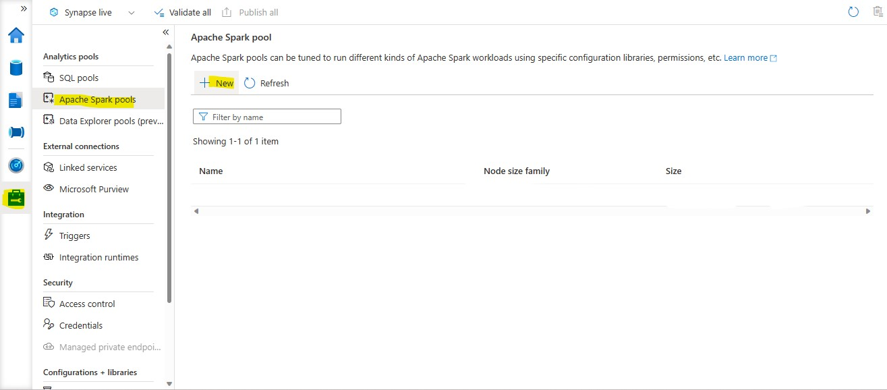
   
5. Give the **Name** as ``sparkpool``. Then click on **Review and Create**.  
   
   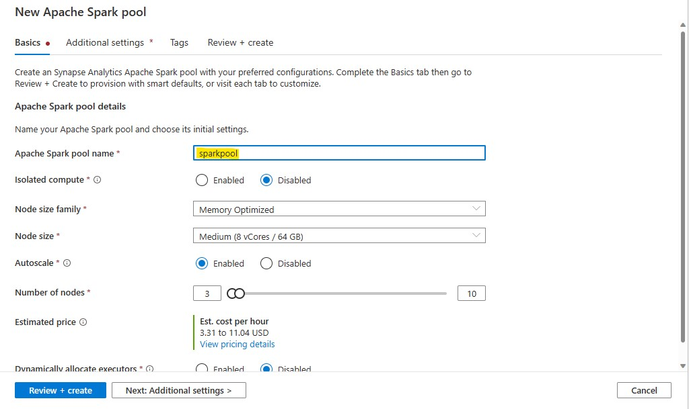
   
7. Under **Develop** tab, create a **new Notebook** with the name ``Notebook1``.  
   
   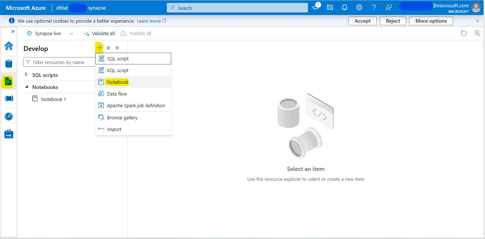
   
9. Paste the following commands in the notebook.  


```text
   import com.microsoft.spark.sqlanalytics
   from com.microsoft.spark.sqlanalytics.Constants import Constants

   df=spark.read.format('parquet').load('abfss://data@adlsrzrwjwoong4im.dfs.core.windows.net/retailorg/tables/dim_products/')
   (df.write.option(Constants.SERVER, "dblab-rzrwjw-synapse.sql.azuresynapse.net")
   .option(Constants.TEMP_FOLDER, "abfss://data@adlsrzrwjwoong4im.dfs.core.windows.net/staging").mode("overwrite")
   .synapsesql("dedicatedPool.dbo.dim_products"))
```

```text
   df1=spark.read.format('parquet').load('abfss://data@adlsrzrwjwoong4im.dfs.core.windows.net/retailorg/tables/dim_customers/')
   (df1.write.option(Constants.SERVER, "dblab-rzrwjw-synapse.sql.azuresynapse.net")
   .option(Constants.TEMP_FOLDER, "abfss://data@adlsrzrwjwoong4im.dfs.core.windows.net/staging")
   .mode("overwrite").synapsesql("dedicatedPool.dbo.dim_customers"))
```

```text
   df2=spark.read.format('parquet').load('abfss://data@adlsrzrwjwoong4im.dfs.core.windows.net/retailorg/tables/fact_sales_orders/')
   (df2.write.option(Constants.SERVER, "dblab-rzrwjw-synapse.sql.azuresynapse.net")
   .option(Constants.TEMP_FOLDER, "abfss://data@adlsrzrwjwoong4im.dfs.core.windows.net/staging")
   .mode("overwrite").synapsesql("dedicatedPool.dbo.fact_sales_orders"))
```

```text
   df3=spark.read.format('parquet').load('abfss://data@adlsrzrwjwoong4im.dfs.core.windows.net/retailorg/tables/fact_customer_sales/')
   (df3.write.option(Constants.SERVER, "dblab-rzrwjw-synapse.sql.azuresynapse.net")
   .option(Constants.TEMP_FOLDER, "abfss://data@adlsrzrwjwoong4im.dfs.core.windows.net/staging")
   .mode("overwrite").synapsesql("dedicatedPool.dbo.fact_customer_sales"))
```

4. After pasting all commands, click on **Run All**. Then proceed to **Validate** and **Publish** your Notebook.
   
   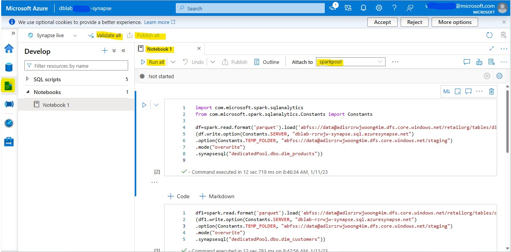
   
6. Go to **Integrate** tab. Click on **Create a Pipeline**.
   
   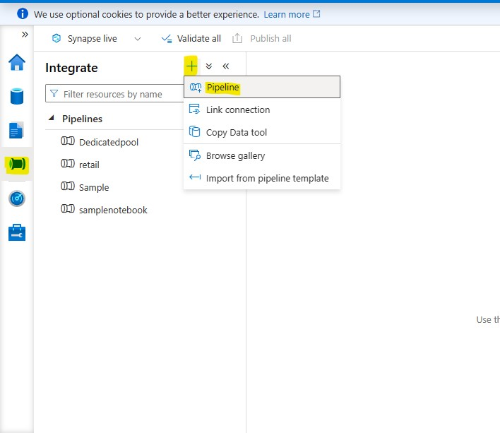
   
8. Give the **Name** in the **Properties** pane as ``samplenotebook``.
9. Find **Notebook** activity under **Synapse** from **Activities** and drag it to the **Pipeline Canvas**.
   
   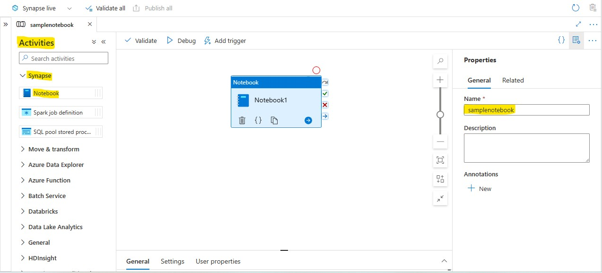
   
11. Expand the **Configuration** pane and in the **Settings** tab, select **Notebook1** in Notebook and **sparkpool** in Spark Pool.
    
    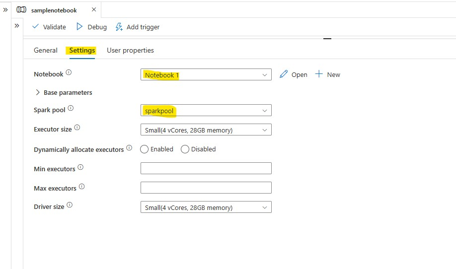
    
13. Once done, **Validate** and **Debug** your pipeline. Then proceed to **Publish** the pipeline.
    
    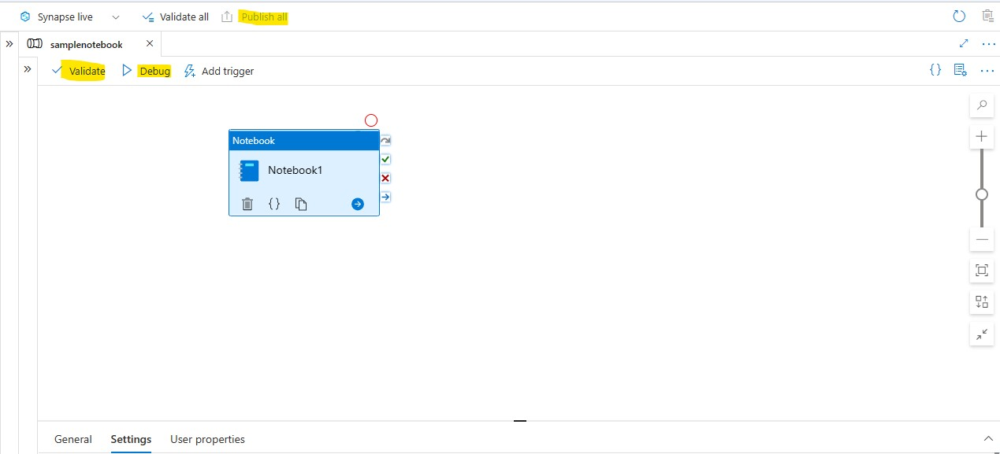
    
15. Go to **Data** in the left pane. Under the **workspace** tab, expland the **sqldatabase** and expand **tables** and verify that the following tables are present.
    * dbo.dim_customers
    * dbo.dim_products
    * dbo.fact_customer_sales
    * dbo.fact_sales_orders
    
    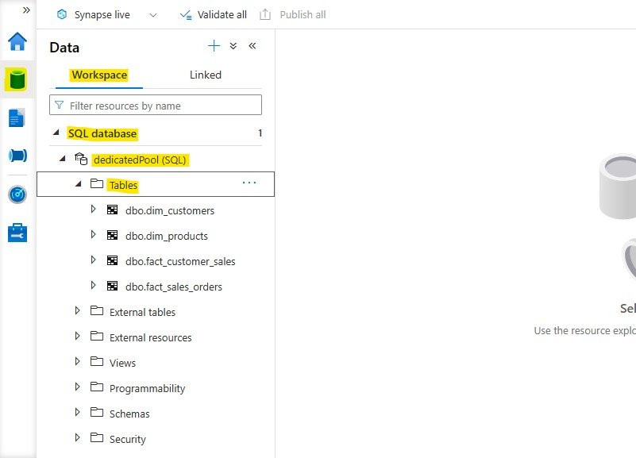
    
11. Install **Power BI Desktop** from **Microsoft Store**.
12. Once installed, open it and click on **Get Data**.
    
    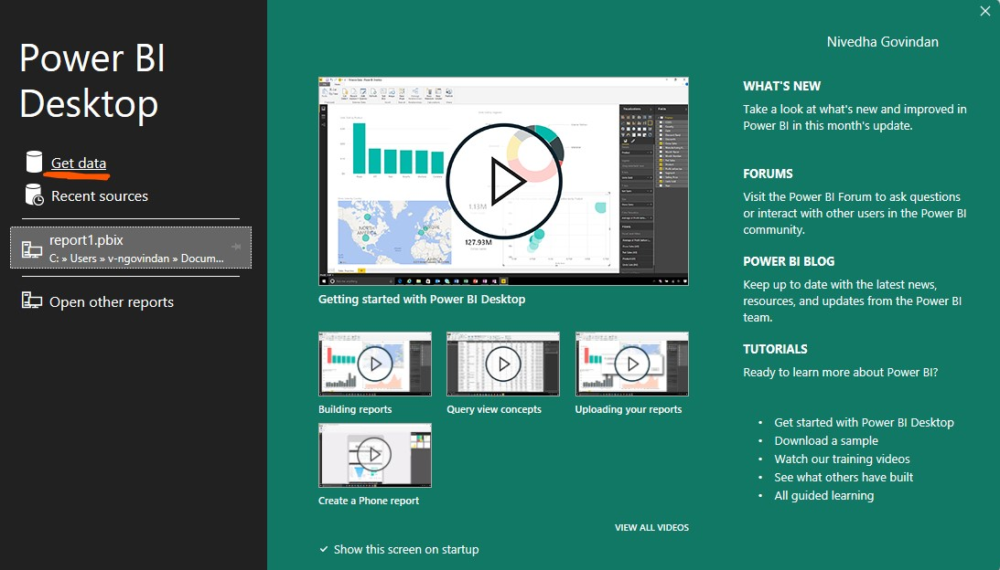
    
14. In the pop-up, click on **Azure**, find **Azure Synapse Analytics Workspace(beta)** and click on **Connect**.
    
    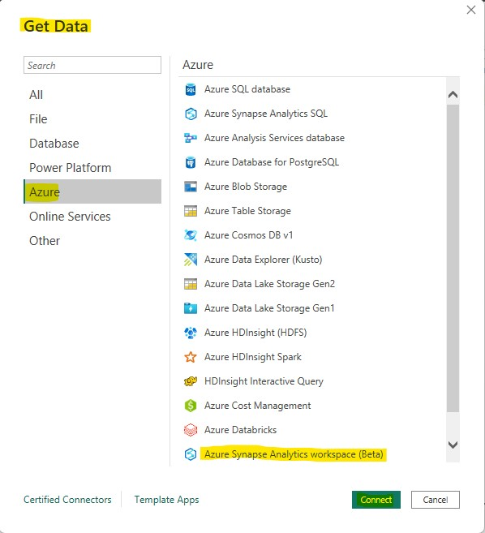
    
16. In the *Third Party Service* pop-up, click on **Continue**.
    
    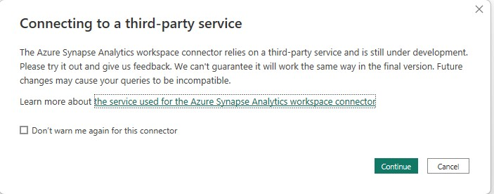
    
18. Sign in with your credentials. 
19. Once signed in, select your  **Synapse Workspace - dblab-{random-string}-synapse** from the list of workspaces.
21. Expand **Dedication SQL Pool** and select all the tables. Then click on **Load**.
    
    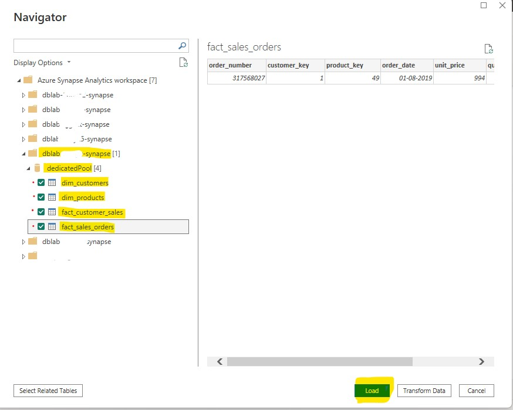
    
23. Once the tables are loaded, you will find them under **Fields**. Here you can select any column from any table as your x-axis and y-axis and create a graph for visualisation.
    
    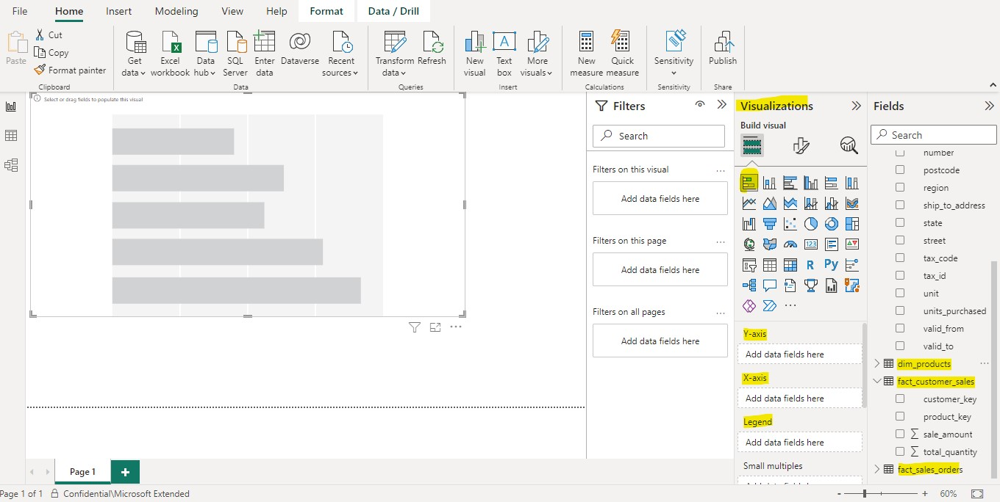
    
